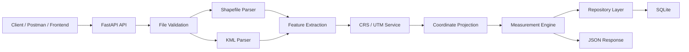

# Geospatial File Measurement API

> A production-ready FastAPI backend for processing geospatial vector files and calculating accurate area and length measurements using automatic UTM reprojection.


\

## Overview

The **Geospatial File Measurement API** is a RESTful backend service designed to process geospatial vector data uploaded as **KML files or Shapefile ZIP archives**.

The application extracts geometries and attributes, automatically determines an appropriate **UTM coordinate system**, converts geographic coordinates from latitude/longitude into metric coordinates, and calculates accurate measurements such as:

* Polygon area
* Polygon area in hectares and square kilometers
* LineString length
* Feature-level measurements
* Overall file statistics

The processed data and measurement results are persisted in **SQLite** for later retrieval.

## Problem Statement

Geospatial files commonly use geographic coordinates such as **WGS 84 (`EPSG:4326`)**, where coordinates are represented in degrees.

Directly calculating distance or area using latitude/longitude values can produce inaccurate results because degrees are not metric units.

This project solves the problem by:

1. Accepting KML and Shapefile ZIP files.
2. Extracting geometries and feature attributes.
3. Determining the feature centroid.
4. Automatically selecting the appropriate UTM zone.
5. Reprojecting coordinates into metric space.
6. Calculating area and length using projected coordinates.
7. Persisting processed results in SQLite.
8. Returning structured JSON responses through REST APIs.

## Key Features

* **Multi-format file processing**

  * KML
  * Shapefile ZIP archives

* **Automatic CRS handling**

  * Detects geographical location from feature centroids
  * Automatically determines the appropriate UTM zone
  * Converts coordinates into metric units

* **Geometry measurement**

  * Polygon / MultiPolygon area
  * LineString / MultiLineString length
  * Point geometry handling
  * Unsupported geometry handling

* **RESTful API**

  * File upload
  * File listing
  * File details
  * Measurement retrieval
  * File deletion
  * Health check

* **Persistent storage**

  * SQLite database
  * Repository Pattern

* **API documentation**

  * Swagger UI
  * ReDoc
  * OpenAPI schema

* **Automated testing**

  * Unit tests
  * Integration tests
  * Pytest

## Architecture



### Processing Flow

```text
File Upload
     ↓
File Validation
     ↓
Geometry & Attribute Extraction
     ↓
Centroid Detection
     ↓
UTM Zone Selection
     ↓
Coordinate Reprojection
     ↓
Area / Length Calculation
     ↓
Database Persistence
     ↓
Structured API Response
```

## Technology Stack

| Layer                | Technology                 |
| -------------------- | -------------------------- |
| Language             | Python                     |
| Framework            | FastAPI                    |
| API Server           | Uvicorn                    |
| Validation           | Pydantic                   |
| Configuration        | pydantic-settings          |
| Shapefile Processing | PyShp                      |
| KML Processing       | Python XML Parser          |
| Projection           | Custom Transverse Mercator |
| Database             | SQLite                     |
| Testing              | Pytest, HTTPX              |
| API Documentation    | OpenAPI / Swagger / ReDoc  |

## Project Structure

```text
geospatial-measurement-api/
│
├── app/
│   ├── main.py
│   ├── config.py
│   ├── database.py
│   │
│   ├── api/
│   │   └── files.py
│   │
│   ├── models/
│   │   └── geospatial.py
│   │
│   ├── repositories/
│   │   └── geospatial_repository.py
│   │
│   ├── schemas/
│   │   └── geospatial.py
│   │
│   └── services/
│       ├── shapefile_parser.py
│       ├── kml_parser.py
│       ├── crs_service.py
│       └── measurement_service.py
│
├── sample_data/
│   ├── generate_samples.py
│   ├── sample_survey.kml
│   └── sample_shapefile.zip
│
├── tests/
│   ├── conftest.py
│   ├── test_files_api.py
│   ├── test_parsers.py
│   └── test_crs_measurements.py
│
├── .gitignore
├── pytest.ini
├── requirements.txt
├── README.md
└── LICENSE
```

## API Endpoints

| Method   | Endpoint                             | Description                          |
| -------- | ------------------------------------ | ------------------------------------ |
| `POST`   | `/api/files/`                        | Upload and process a geospatial file |
| `GET`    | `/api/files/`                        | List processed files                 |
| `GET`    | `/api/files/{file_id}/`              | Retrieve file information            |
| `GET`    | `/api/files/{file_id}/measurements/` | Retrieve measurements and summary    |
| `DELETE` | `/api/files/{file_id}/`              | Delete file and feature records      |
| `GET`    | `/health`                            | API health check                     |

## Example API Request

### Upload a KML file

```bash
curl -X POST "http://127.0.0.1:8000/api/files/" \
     -F "file=@sample_data/sample_survey.kml"
```

### Example Response

```json
{
  "id": "e4a7b219c001",
  "filename": "sample_survey.kml",
  "file_type": "KML",
  "feature_count": 3,
  "crs": "EPSG:4326",
  "status": "COMPLETED"
}
```

## Measurement Output

The measurement endpoint returns feature-level results together with file-level summary statistics.

Example:

```json
{
  "summary": {
    "total_features": 3,
    "polygon_count": 1,
    "linestring_count": 1,
    "point_count": 1,
    "total_area_sq_m": 307221.8415,
    "total_area_hectares": 30.722184,
    "total_length_m": 1412.502
  }
}
```

## Getting Started

### Prerequisites

* Python 3.10+
* Git

### 1. Clone the repository

```bash
git clone https://github.com/<your-username>/geospatial-measurement-api.git

cd geospatial-measurement-api
```

### 2. Create a virtual environment

#### Windows

```bash
python -m venv .venv

.\.venv\Scripts\Activate.ps1
```

#### Linux / macOS

```bash
python3 -m venv .venv

source .venv/bin/activate
```

### 3. Install dependencies

```bash
pip install -r requirements.txt
```

### 4. Start the API

```bash
python -m uvicorn app.main:app --reload --port 8000
```

The API will be available at:

```text
http://127.0.0.1:8000
```

### 5. Open API Documentation

Swagger UI:

```text
http://127.0.0.1:8000/docs
```

ReDoc:

```text
http://127.0.0.1:8000/redoc
```

### 6. Run Tests

```bash
python -m pytest
```

## Environment Configuration

Create a `.env` file in the project root:

```env
PROJECT_NAME="Geospatial File Measurement API"
VERSION="1.0.0"
API_V1_STR="/api"
DATABASE_URL="sqlite:///./geospatial_api.db"
UPLOAD_DIR="./uploads"
MAX_UPLOAD_SIZE_MB=50
```

> Never commit `.env` files or credentials to the repository. Use `.env.example` for shareable configuration.

## Testing

The project includes automated unit and integration tests covering:

* API endpoints
* File processing
* KML parsing
* Shapefile parsing
* CRS calculations
* Measurement calculations
* Database operations

Run:

```bash
python -m pytest
```

## Engineering Challenges & Solutions

| Challenge                                      | Solution                                                                             |
| ---------------------------------------------- | ------------------------------------------------------------------------------------ |
| Geographic coordinates are measured in degrees | Automatically reproject coordinates into an appropriate UTM metric coordinate system |
| Different KML namespace formats                | Implemented namespace-independent XML parsing                                        |
| Point geometries cannot produce area/length    | Return `NOT_APPLICABLE` instead of failing                                           |
| Unsupported geometry types                     | Gracefully return `UNSUPPORTED` status                                               |
| SQLite connection handling                     | Use controlled database connection lifecycle for API requests                        |
| Deployment portability                         | Use a pure-Python projection and measurement implementation                          |

## Design Principles

The project follows several backend engineering principles:

* Separation of concerns
* Service-layer architecture
* Repository Pattern
* Dependency-based configuration
* Input validation
* Structured API responses
* Graceful error handling
* Automated testing
* Environment-based configuration

## Future Improvements

Potential future enhancements include:

* PostgreSQL/PostGIS support
* Docker containerization
* Authentication and authorization
* Background processing for large files
* Cloud object storage
* Rate limiting
* CI/CD pipeline
* Geospatial visualization frontend
* Additional coordinate reference systems
* Async processing for large datasets

## Use Cases

This API can support applications such as:

* GIS platforms
* Land and property analysis
* Drone survey processing
* Urban planning systems
* Environmental mapping
* Infrastructure analysis
* Geographic data processing pipelines

##
