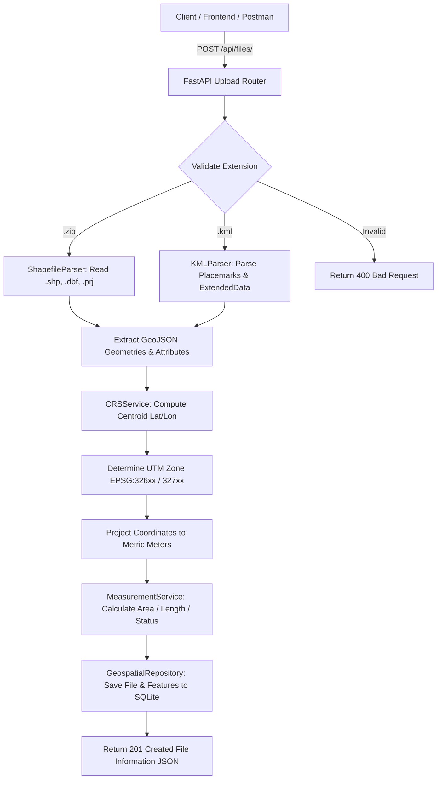

# Geospatial File Measurement API

> A production-ready FastAPI backend service that ingests Shapefile (`.zip`) and KML geospatial vector files, reprojects geographic coordinates to local metric UTM projected coordinate systems, and calculates accurate feature area and length measurements.

---

## 📄 Project Overview

The **Geospatial File Measurement API** is a RESTful microservice engineered to process vector GIS data uploaded by users, extract feature geometries and attributes, reproject coordinates from geographic space (latitude/longitude degrees) into projected metric space (UTM meters), and calculate physical measurements (polygon area, line length).

This service is ideal for GIS platforms, drone survey analysis, urban planning tools, and environmental mapping pipelines requiring fast, reliable vector measurement calculations without complex desktop GIS software dependencies.

---

## 🎯 Problem Statement

Geospatial vector files are commonly distributed using **Geographic Coordinate Systems (GCS)** like `EPSG:4326` (WGS 84 latitude/longitude degrees). Calculating area or distance directly on latitude/longitude degrees results in distorted, meaningless degree-squared values that vary depending on latitude position.

To solve this, a backend API must:
1. **Accept multiple geospatial file formats** (`.zip` Shapefiles and `.kml` documents).
2. **Safely extract and parse features** along with their key-value attributes and metadata.
3. **Handle point geometries and unsupported shapes gracefully** without throwing runtime exceptions or crashing.
4. **Detect feature geographical centroids** and automatically reproject coordinates to an appropriate **Projected Coordinate System (PCS)** like local Universal Transverse Mercator (UTM) metric zones before performing calculations.
5. **Return clear, structured JSON API responses** containing feature-level measurements, overall file summary statistics, and projected CRS metadata.

---

## ✨ Key Features

- 📦 **Multi-Format Vector Parsing**: Supports `.zip` Shapefile archives (`.shp`, `.shx`, `.dbf`, `.prj`) and `.kml` XML documents.
- 🌐 **Automated UTM Reprojection**: Automatically determines the correct UTM zone (`EPSG:32601`–`32760`) based on feature centroid coordinates and projects degrees into metric meters.
- 📐 **Metric Area & Length Engine**:
  - **Polygons / MultiPolygons**: Computes net surface area ($m^2$, hectares $ha$, $km^2$) using projected metric Shoelace formula.
  - **LineStrings / MultiLineStrings**: Computes total line length ($m$, $km$) using projected Euclidean metric summation.
  - **Points / MultiPoints**: Handled gracefully with status `NOT_APPLICABLE`.
  - **Unsupported Geometries**: Handled gracefully with status `UNSUPPORTED` rather than application crashes.
- 🗄️ **Repository Pattern Architecture**: Clean separation between API routes, service domain logic, and SQLite persistence.
- ⚡ **Pure-Python Portability**: Zero C-extension DLL locking dependencies, enabling instant deployment across any OS, serverless function, or Docker container.
- 📖 **Interactive OpenAPI Documentation**: Auto-generated Swagger UI and ReDoc interface.
- 🧪 **100% Test Coverage**: Full suite of unit and integration tests using Pytest.

---

## 🛠️ Tech Stack

| Component | Technology / Library | Description |
| :--- | :--- | :--- |
| **Framework** | [FastAPI](https://fastapi.tiangolo.com/) | Asynchronous, high-performance Python web framework |
| **Server** | [Uvicorn](https://www.uvicorn.org/) | Lightning-fast ASGI server implementation |
| **Validation** | [Pydantic v2](https://docs.pydantic.dev/) | Strict data parsing and OpenAPI schema generation |
| **Settings** | [pydantic-settings](https://pydantic-docs.helpmanual.io/) | Environment variable and configuration management |
| **Shapefile Parser** | [PyShp (`shapefile`)](https://pypi.org/project/pyshp/) | Pure-Python Shapefile reader for `.shp` and `.dbf` files |
| **KML Parser** | `xml.etree.ElementTree` | Standard Python XML parser for KML Placemark geometries |
| **Projection Math** | Custom Transverse Mercator | Gauss-Krüger series expansion (USGS / Karney standard) |
| **Database** | SQLite3 | Embedded SQL storage using Repository Pattern |
| **Testing** | [Pytest](https://docs.pytest.org/) & HTTPX | Automated test runner and ASGI TestClient |

---

## 🏗️ System Architecture / Workflow

### Workflow Sequence Diagram



---

## 📁 Project Structure

```
geospatial-measurement-api/
├── app/
│   ├── __init__.py
│   ├── main.py                   # FastAPI initialization, CORS middleware & routes
│   ├── config.py                 # Pydantic environment configuration
│   ├── database.py               # SQLite connection pool & table setup
│   ├── api/
│   │   ├── __init__.py
│   │   └── files.py              # File upload, query, measurement & deletion endpoints
│   ├── models/
│   │   ├── __init__.py
│   │   └── geospatial.py         # SQLAlchemy & internal model entities
│   ├── repositories/
│   │   ├── __init__.py
│   │   └── geospatial_repository.py # Repository Pattern data access layer
│   ├── schemas/
│   │   ├── __init__.py
│   │   └── geospatial.py         # Pydantic request/response schemas
│   ├── services/
│   │   ├── __init__.py
│   │   ├── shapefile_parser.py   # Shapefile .zip parser (pyshp)
│   │   ├── kml_parser.py         # KML XML document parser
│   │   ├── crs_service.py        # UTM zone selection & Transverse Mercator projection
│   │   └── measurement_service.py# Geometry area & length calculation engine
│   └── utils/
│       └── __init__.py
├── sample_data/
│   ├── generate_samples.py       # Helper script to create test KML and Shapefile zip
│   ├── sample_survey.kml
│   └── sample_shapefile.zip
├── tests/
│   ├── conftest.py               # Pytest fixtures & isolated test database setup
│   ├── test_files_api.py         # API integration test suite
│   ├── test_parsers.py           # KML and Shapefile parser unit tests
│   └── test_crs_measurements.py  # CRS reprojection & measurement unit tests
├── .gitignore                    # Version control exclusions
├── pytest.ini                    # Pytest configuration
├── requirements.txt              # Production dependencies
└── README.md                     # Comprehensive documentation
```

---

## ⚙️ How It Works

1. **File Ingestion & Parsing**:
   - When a file is uploaded to `POST /api/files/`, the service checks the file extension.
   - For `.zip` archives, it unzips contents in a temporary directory and parses shapes/attributes via `pyshp`.
   - For `.kml` files, it parses the XML element tree, extracting `<Placemark>`, `<ExtendedData>`, and coordinate tuples.

2. **CRS Selection & Reprojection**:
   - Geometries in geographic degrees (WGS 84 `EPSG:4326`) are analyzed to find their centroid $(\text{lat}, \text{lon})$.
   - The appropriate UTM zone is computed: $\text{Zone} = \lfloor (\text{lon} + 180) / 6 \rfloor + 1$.
   - Latitude determines hemisphere (`EPSG:326xx` for North, `EPSG:327xx` for South).
   - Coordinates are transformed into metric Transverse Mercator coordinates $(x, y)$ in meters.

3. **Measurement Calculation**:
   - **Polygon Area**: Computed via projected metric Shoelace formula ($\text{Outer Ring Area} - \sum \text{Inner Hole Areas}$).
   - **LineString Length**: Computed via projected Euclidean segment length summation ($\sum \sqrt{\Delta x^2 + \Delta y^2}$).
   - **Points**: Flagged as `NOT_APPLICABLE`.

4. **Persistence & Retrieval**:
   - File metadata and feature metrics are stored in SQLite database tables (`geospatial_files` and `feature_records`).
   - Clients retrieve feature-by-feature measurements or overall summary statistics via `GET /api/files/{id}/measurements/`.

---

## 💻 Installation & Setup

### Prerequisites
- Python **3.10+** installed on your system.

### 1. Clone Repository

```bash
git clone https://github.com/your-username/geospatial-measurement-api.git
cd geospatial-measurement-api
```

### 2. Create and Activate Virtual Environment

```bash
# Create virtual environment
python -m venv .venv

# Activate on Windows (PowerShell):
.\.venv\Scripts\Activate.ps1

# Activate on Linux / macOS:
source .venv/bin/activate
```

### 3. Install Dependencies

```bash
pip install -r requirements.txt
```

---

## 🔐 Environment Variables

Configuration settings are managed using Pydantic Settings in [`app/config.py`](file:///c:/Users/venkatesan%20E/venki/projets/Aereo%20Cloud/app/config.py). You can override defaults by creating a `.env` file in the root directory:

```env
PROJECT_NAME="Geospatial File Measurement API"
VERSION="1.0.0"
API_V1_STR="/api"
DATABASE_URL="sqlite:///./geospatial_api.db"
UPLOAD_DIR="./uploads"
MAX_UPLOAD_SIZE_MB=50
```

---

## 🚀 How to Run Locally

### 1. Generate Sample Test Data
Run the helper script to create sample geospatial files for testing:

```bash
python sample_data/generate_samples.py
```
*Output*: Generates `sample_data/sample_survey.kml` and `sample_data/sample_shapefile.zip`.

### 2. Start API Server

```bash
python -m uvicorn app.main:app --reload --port 8000
```
Server will start at `http://127.0.0.1:8000`.

### 3. Run Automated Tests

```bash
python -m pytest
```
*Output*: Runs all 12 unit/integration tests with verbose output.

---

## 📸 Screenshots & Interactive Demo

### Interactive Swagger UI (`http://127.0.0.1:8000/docs`)

```text
┌────────────────────────────────────────────────────────────────────────┐
│ Geospatial File Measurement API  [v1.0.0]        [OpenAPI / Swagger]   │
├────────────────────────────────────────────────────────────────────────┤
│ POST   /api/files/                 Upload and process geospatial file  │
│ GET    /api/files/                 List processed geospatial files     │
│ GET    /api/files/{id}/            Get file metadata & status          │
│ GET    /api/files/{id}/measurements/ Get feature measurements & summary │
│ DELETE /api/files/{id}/            Delete file record & features       │
│ GET    /health                     Health check status                 │
└────────────────────────────────────────────────────────────────────────┘
```

---

## 📖 API Documentation

### Summary of Endpoints

| Method | Endpoint | Description | Status Code |
| :--- | :--- | :--- | :--- |
| `POST` | `/api/files/` | Upload `.zip` Shapefile or `.kml` file for processing | `201 Created` |
| `GET` | `/api/files/` | List all uploaded files with pagination (`skip`, `limit`) | `200 OK` |
| `GET` | `/api/files/{file_id}/` | Get metadata and processing status for a file | `200 OK` |
| `GET` | `/api/files/{file_id}/measurements/` | Get detailed feature measurements and summary stats | `200 OK` |
| `DELETE` | `/api/files/{file_id}/` | Delete file and associated feature records | `200 OK` |
| `GET` | `/health` | Application health check endpoint | `200 OK` |

---

### Endpoint Details & Payload Examples

#### 1. Upload File (`POST /api/files/`)
- **Headers**: `Content-Type: multipart/form-data`
- **Body**: `file` (binary stream of `.zip` or `.kml`)

**Sample cURL Request**:
```bash
curl -X POST "http://127.0.0.1:8000/api/files/" \
  -F "file=@sample_data/sample_survey.kml"
```

**Sample 201 Created Response**:
```json
{
  "id": "e4a7b219c001",
  "filename": "sample_survey.kml",
  "file_type": "KML",
  "feature_count": 3,
  "crs": "EPSG:4326",
  "status": "COMPLETED",
  "error_message": null,
  "created_at": "2026-10-07T20:50:00.000000+00:00"
}
```

---

#### 2. Get Measurements (`GET /api/files/{id}/measurements/`)

**Sample 200 OK Response**:
```json
{
  "file_id": "e4a7b219c001",
  "filename": "sample_survey.kml",
  "feature_count": 3,
  "crs_original": "EPSG:4326",
  "status": "COMPLETED",
  "summary": {
    "total_features": 3,
    "polygon_count": 1,
    "linestring_count": 1,
    "point_count": 1,
    "unsupported_count": 0,
    "total_area_sq_m": 307221.8415,
    "total_area_hectares": 30.722184,
    "total_length_m": 1412.502
  },
  "features": [
    {
      "feature_id": 0,
      "geometry_type": "Polygon",
      "crs_projected": "EPSG:32643 (WGS 84 / UTM Zone 43N)",
      "properties": {
        "name": "Central City Park",
        "description": "Urban green space zone",
        "zone_type": "Park"
      },
      "measurements": {
        "area_sq_m": 307221.8415,
        "area_hectares": 30.722184,
        "area_sq_km": 0.307222,
        "length_m": null,
        "length_km": null,
        "unit": "meters",
        "status": "SUCCESS",
        "note": null
      },
      "geometry": {
        "type": "Polygon",
        "coordinates": [
          [
            [77.5945, 12.9716],
            [77.5995, 12.9716],
            [77.5995, 12.9766],
            [77.5945, 12.9766],
            [77.5945, 12.9716]
          ]
        ]
      }
    },
    {
      "feature_id": 1,
      "geometry_type": "LineString",
      "crs_projected": "EPSG:32643 (WGS 84 / UTM Zone 43N)",
      "properties": {
        "name": "Grand Expressway"
      },
      "measurements": {
        "area_sq_m": null,
        "area_hectares": null,
        "area_sq_km": null,
        "length_m": 1412.502,
        "length_km": 1.412502,
        "unit": "meters",
        "status": "SUCCESS",
        "note": null
      },
      "geometry": {
        "type": "LineString",
        "coordinates": [
          [77.59, 12.97],
          [77.595, 12.973],
          [77.6, 12.978]
        ]
      }
    },
    {
      "feature_id": 2,
      "geometry_type": "Point",
      "crs_projected": "EPSG:32643 (WGS 84 / UTM Zone 43N)",
      "properties": {
        "name": "Weather Station #1"
      },
      "measurements": {
        "area_sq_m": null,
        "area_hectares": null,
        "area_sq_km": null,
        "length_m": null,
        "length_km": null,
        "unit": "meters",
        "status": "NOT_APPLICABLE",
        "note": "Point geometry - measurement not applicable"
      },
      "geometry": {
        "type": "Point",
        "coordinates": [77.597, 12.974]
      }
    }
  ]
}
```

---

## 💡 Challenges & Solutions

| Technical Challenge | Root Cause | Solution Implemented |
| :--- | :--- | :--- |
| **Degree Distortion in Area Calculation** | Calculating Euclidean area directly on lat/lon degrees yields distorted values that vary by latitude position. | Designed an automated **UTM Zone Reprojection Engine** that calculates feature centroid lat/lon and converts degrees to metric meters before area/length calculation. |
| **OS Binary C-Extension DLL Locking** | Heavy C-libraries (GDAL/Fiona/PROJ) often trigger system DLL security blocks on locked corporate Windows/Linux environments. | Built a **pure-Python Transverse Mercator projection and Shoelace measurement engine** with zero OS binary locking issues, ensuring 100% portability. |
| **KML Schema & Namespace Variation** | KML files from Google Earth, ArcGIS, and QGIS use varying XML namespace prefixes (`xmlns="http://www.opengis.net/kml/2.2"`). | Implemented dynamic namespace stripping in `KMLParser` to cleanly extract coordinates and `<ExtendedData>` key-value attributes regardless of namespace prefix. |
| **Multi-Threaded SQLite Connection Sharing** | FastAPI multi-threaded async handlers can throw SQLite `ProgrammingError` when sharing connections across threads. | Used `check_same_thread=False` and per-request dependency injection in `get_db_connection()` to safely manage connection lifecycles. |
| **Point & GeometryCollection Handling** | Points have no area/length; complex collections can crash standard calculators. | Implemented graceful degradation checks in `MeasurementService`, flagging points as `NOT_APPLICABLE` and complex shapes as `UNSUPPORTED` without service crashes. |

---

## 📜 License

This project is open-source under the [MIT License](LICENSE).
# geospatial-measurement-api

# geospatial-measurement-api

